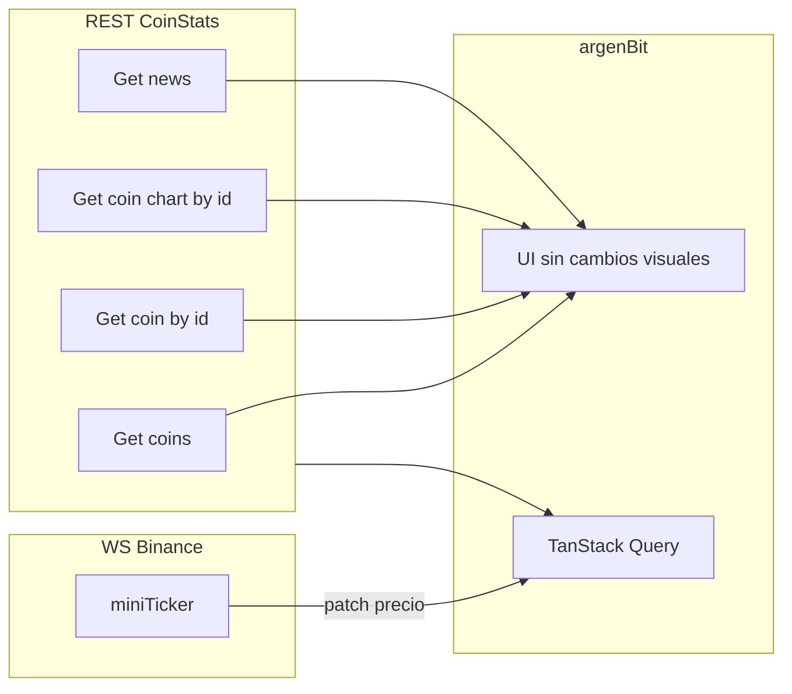

# Integración CoinStats (REST) + Binance (WebSocket) — reemplazo de CryptoCompare

Documento para el equipo: usar **[CoinStats Crypto API](https://coinstats.app/api-docs/)** como **REST único** para **mercado y noticias** (misma cuenta, créditos y modelo de datos unificado), y **Binance Spot WebSocket público** para **precios en vivo** en lista, detalle y favoritos — mismo rol que el streamer CryptoCompare (`CCCAGG` vía WS).

**Referencia CoinStats (humano + agente):** [API docs](https://coinstats.app/api-docs/), índice máquina [llms.txt](https://coinstats.app/docs/llms.txt), [autenticación](https://coinstats.app/docs/authentication.md), [límites / créditos](https://coinstats.app/docs/rate-limits.md), [precios](https://openapi.coinstats.app/pricing). Para MCP en Cursor: [Connect to CoinStats MCP](https://coinstats.app/docs/mcp/connecting.md).

### Alcance: APIs + arquitectura en todo el repo (UX visual ya cerrado)

El **aspecto visual de pantallas** (layout, jerarquía, flujos) **no se rediseña**: colores, tipografías y espaciados deben **verse igual** al usuario salvo ajustes mínimos inevitables de datos.

Sí entra en alcance, de forma **explícita**:

- **Reemplazo de proveedores y cableado de datos** (REST CoinStats, WS Binance, cliente HTTP único, React Query, mappers, DTOs, `patch` de caché, `EXPO_PUBLIC_*`, storage si cambian ids).
- **Refactor masivo de estructura** (`common` / `core` / `features`), **renombre de funciones y símbolos** a nombres cortos y legibles, y **orden del código** según la sección *Arquitectura front* y *Código limpio* más abajo.
- **Centralización de tema y estilos** en `core/theme` (tokens) y uso desde componentes, **sin** cambiar el look por el solo hecho de mover archivos.

La app debe **comportarse igual** salvo diferencias propias de los datos (por ejemplo precio en par `*USDT` de Binance vs agregado CCCAGG de CryptoCompare).

---

## Arquitectura front — estructura objetivo (`common` / `core` / `features`)

**Objetivo:** mantener el código alineado con una arquitectura por **dominio** (Screaming Architecture), capas claras y **un solo cliente HTTP** en el núcleo, de forma que el cambio CryptoCompare → **CoinStats + Binance** toque sobre todo **adaptadores** (REST, WS, mappers) y no la UI.

**Reglas que el equipo debe cumplir al tocar código (nuevo o migrado):**

1. **`core/api`:** un único lugar para instanciar el cliente HTTP (p. ej. `http.client.ts`); interceptores, base URL y cabeceras (API key CoinStats) viven ahí. Los módulos de datos **no** crean clientes sueltos.
2. **`repository`:** solo llamadas a red (CoinStats REST, endpoints necesarios) y parse mínimo si aplica; **sin** reglas de negocio ni React.
3. **`service` (opcional por feature):** lógica **pura** (validaciones, transformaciones que no sean solo mapeo DTO → dominio); **sin** `useState` / `useEffect`.
4. **`features/*/hooks`:** orquestación con **TanStack Query** (equivalente moderno a “loading / error / data” del patrón clásico); los hooks llaman a repository/service y exponen lo que consumen pantallas y componentes del feature.
5. **`features/*/screen`:** pantallas **livianas**: componen UI y delegan en hooks; evitar lógica de negocio gorda en la screen.
6. **`features/<modulo>/index.ts`:** **única puerta pública** del módulo; el resto de la app importa desde `@/features/<modulo>` (o el alias que use el proyecto), **no** desde subcarpetas internas de otro feature.
7. **`core/navigation`:** equivalente React Native a “router” web: stacks, tabs, tipos de rutas (React Navigation). No mezclar definición de navegación dentro de componentes de negocio.
8. **`ws/` (o `core/ws`):** adaptador de **Binance WebSocket** y utilidades de parcheo de caché; mismo espíritu que repository: IO sin reglas de producto complejas.

**Árbol objetivo bajo `src/`** (los nombres de archivo son orientativos; lo importante son las carpetas y las responsabilidades):

```text
src/
├── App.tsx
├── common/
│   ├── components/     # UI reutilizable (botones, loaders, banners genéricos)
│   ├── hooks/          # utilidades (debounce, fuentes, duración mínima de loader, etc.)
│   └── utils/          # funciones puras (formato moneda/fecha, helpers sin React)
├── core/
│   ├── api/
│   │   ├── http.client.ts   # único cliente HTTP + cabeceras CoinStats
│   │   └── api.handler.ts   # opcional: normalizar { data, error } / status
│   ├── config/         # env, queryClient, dayjs, expoRuntime, URLs base streamer/WS
│   ├── navigation/     # AppNavigator, tabs, stacks, types
│   ├── store/          # estado global (p. ej. Zustand)
│   └── theme/          # colores, tipografía, spacing
├── features/
│   ├── markets/
│   │   ├── components/
│   │   ├── hooks/      # lista, stream precios, queries mercado
│   │   ├── repository/ # REST mercado + acoplamiento mínimo a CoinStats
│   │   ├── service/    # opcional: reglas puras del listado
│   │   ├── screen/
│   │   └── index.ts
│   ├── news/
│   ├── favorites/
│   ├── alerts/
│   └── asset-detail/   # detalle + histórico (o nombre equivalente al dominio)
├── domain/             # modelos compartidos (Asset, NewsArticle, …)
├── storage/            # AsyncStorage (favoritos, preferencias de alertas)
└── ws/                 # cliente Binance, parse de ticks, patch de caches TanStack
```

### Refactor masivo (objetivo del equipo)

**Decisión:** reorganizar **todo** `src/` hacia el árbol anterior, **no** solo el código que toque la API. La migración CoinStats/Binance puede hacerse **en el mismo epic** o en fases (por feature: `markets` → `news` → …), pero el **estado final** del repo debe cumplir carpetas, barrels `index.ts` y capas definidas arriba.

**Estrategia recomendada:** varios PRs por módulo para reducir riesgo (imports rotos, tests); al cerrar el epic no debe quedar la estructura vieja mezclada salvo transitorio documentado. Los DTO y mappers compartidos viven en `core/api/dto` y `core/api/mappers` cuando varios features los consumen.

### Convenciones de nombres (simples y fáciles de leer)

Objetivo: **que el nombre cuente qué hace** en una frase corta, sin abreviaturas crípticas ni composiciones larguísimas.

| Dónde | Convención | Ejemplos |
|-------|--------------|----------|
| **Funciones y métodos** | Verbo + objeto; en inglés o español **pero consistente en el archivo/módulo**. Evitar cadenas tipo `mapPricemultifullResponseToAssetDetailDto` → preferir `toAssetDetail` en el mapper + tipo importado, o `mapPriceFullToDetail`. | `fetchCoins`, `parseTicker`, `toNewsArticle` |
| **Hooks** | Prefijo `use` + dominio acción. | `useMarketsQuery`, `useFavoriteCoins` |
| **Repositories** | Objeto con métodos imperativos claros. | `marketsRepository.getPage({ cursor })` |
| **Componentes** | `PascalCase`, nombre de UI. | `CryptoRow`, `NewsRow` |
| **Archivos** | Alineado al export principal (`MarketsHomeScreen.tsx`). | Un componente principal por archivo cuando sea razonable |

Si un nombre “histórico” es largo por el proveedor (p. ej. CryptoCompare), **al migrar a CoinStats renombrar** a términos de dominio argenBit (`coin`, `chart`, `news`), no del vendor.

### Código limpio (criterios mínimos al refactorizar)

- **Un archivo, una responsabilidad principal**; si un archivo supera ~200–300 líneas sin razón fuerte, dividir.
- **Sin código muerto** tras el cambio de API (clientes viejos, env keys no usadas, hooks huérfanos).
- **Dominio estable** (`domain/`): modelos claros; mappers solo traducen API → dominio.
- **Efectos y IO acotados**: red y WebSocket en repository/ws; pantallas sin fetch directo.
- **Tests** en lógica sensible (alertas, parsers, mappers críticos) donde ya existan o al tocar el flujo.

### Estilos visuales y tema (¿dónde van?)

| Qué | Dónde en la arquitectura |
|-----|---------------------------|
| **Tokens de diseño** (paleta, tipografía, espaciado, radios, sombras, zIndex) | `core/theme/` — un solo lugar para **valores** reutilizables. |
| **Componentes UI genéricos** (loader, botón, banner de error) que usan el tema | `common/components/` |
| **Estilos de una feature** (layout de fila mercado, card de noticia) | `features/<modulo>/components/` — `StyleSheet.create` o estilos locales importando tokens desde `core/theme` (**no** números mágicos sueltos si ya existe token). |
| **Navegación** (headers por stack, opciones de tab) | `core/navigation/` o archivos colocados ahí; si un header es muy específico de un feature, el **componente** del header puede vivir en el feature e importarse desde la definición de ruta. |

**Regla:** el **look** no cambia; cambia **dónde vive** el valor (tema) y **quién importa** a quién, para que el código quede ordenado y predecible.

---

## 1. Resumen

| Pieza | Proveedor | Rol |
|-------|-----------|-----|
| Lista mercados, detalle, histórico, favoritos (REST) | **CoinStats** | Mercado agregado, gráficos y **noticias** ([Get News](https://coinstats.app/docs/openapi/get-news.md), etc.). |
| Precio en vivo (WS) | **Binance** público | Igual que hoy con CryptoCompare streamer: actualizar **solo precio** (y lo que definan) en caché TanStack sin depender de polling REST agresivo. |
| WebSocket desde CoinStats | **No asumido** | Doc pública centrada en **REST + MCP**; en cliente móvil se usa **Binance `@miniTicker`** salvo que más adelante haya stream adecuado en tu plan. |

---

## 2. CoinStats — autenticación y límites

- **API REST** con **API key** (cabeceras según [Authentication](https://coinstats.app/docs/authentication.md)).
- **Free tier** con modelo por **créditos** ([Plans & pricing](https://openapi.coinstats.app/pricing), [Credit multipliers](https://coinstats.app/docs/multipliers.md), [Rate limits](https://coinstats.app/docs/rate-limits.md)).
- **Variable sugerida en Expo:** `EXPO_PUBLIC_COINSTATS_API_KEY` (no commitear en repos públicos).
- Conviene **`staleTime`**, paginación acotada y evitar endpoints “caros” en créditos en cada scroll.

Opcional: [On-Demand Crypto Data via x402](https://coinstats.app/docs/ai-agents/x402.md); evaluar si aplica a app consumer.

---

## 3. Binance — WebSocket público (precios actualizados)

**Para streams de mercado públicos no necesitás API key de Binance.**

- [WebSocket Streams (Spot)](https://developers.binance.com/docs/binance-spot-api-docs/web-socket-streams)
- [Market Data Only](https://developers.binance.com/docs/binance-spot-api-docs/faqs/market_data_only) — `wss://data-stream.binance.vision`

**Comportamiento:** ping/pong (~20 s), reconexión periódica, símbolos en **minúsculas** (`btcusdt@miniTicker`). El precio es del **par en Binance** (`USDT` como proxy de USD), no un índice CCCAGG.

---

## 4. Identificadores en la app

CoinStats usa **`coinId`** (ver [Get coin by id](https://coinstats.app/docs/openapi/get-coin-by-id.md)) como identificador estable del activo.

| Concepto | Ejemplo | Uso |
|----------|---------|-----|
| **CoinStats `coinId`** | id devuelto por la API | Detalle, gráfico, favoritos persistidos, noticias si el endpoint lo permite. |
| **Símbolo display** | `BTC` | UI, alertas con `fsym`, mapeo a par Binance `BTCUSDT`. |
| **Stream Binance** | `btcusdt@miniTicker` | Combined stream; `s` (`BTCUSDT`) → base → `fsym` / `coinId` en caché. |

Regla habitual: **`BASE + "USDT"`** en minúsculas, con **excepciones** si no hay par en Binance.

---

## 5. Tabla: sección de la app → endpoints CoinStats (REST)

Rutas y parámetros exactos: cada página enlazada y el [OpenAPI](https://coinstats.app/docs/openapi.json).

| Sección / intención | Doc CoinStats |
|--------------------|---------------|
| Lista / ranking | [Get coins](https://coinstats.app/docs/openapi/get-coins.md) |
| Detalle | [Get coin by id](https://coinstats.app/docs/openapi/get-coin-by-id.md) |
| Histórico / gráfico | [Get coin chart by id](https://coinstats.app/docs/openapi/get-coin-chart-by-id.md) o [Get coins charts](https://coinstats.app/docs/openapi/get-coins-charts.md) |
| Noticias lista | [Get news](https://coinstats.app/docs/openapi/get-news.md) |
| Noticia por id | [Get news by id](https://coinstats.app/docs/openapi/get-news-by-id.md) |
| Noticias por tipo | [Get news by type](https://coinstats.app/docs/openapi/get-news-by-type.md) |
| Fuentes | [Get news sources](https://coinstats.app/docs/openapi/get-news-sources.md) |
| Salud / cuota | [Get API status](https://coinstats.app/docs/openapi/get-api-status.md), [Get credit usage](https://coinstats.app/docs/openapi/get-credit-usage.md) |

Los mappers adaptan respuestas a `Asset`, `AssetDetail`, `NewsArticle`, etc., sin cambiar UI.

---

## 6. Binance — streams (reemplazo streamer CryptoCompare)

- **`<symbol>@miniTicker`** (ej. `btcusdt@miniTicker`).
- Combined: `wss://data-stream.binance.vision/stream?streams=btcusdt@miniTicker/ethusdt@miniTicker`
- Evento **`24hrMiniTicker`**: **`c`** = último precio, **`s`** = par.

Límite práctico de streams por URL / conexiones: acotar como hoy (`MAX_STREAMER_SYMBOLS` o similar).

---

## 7. Flujo lógico



---

## 8. Qué **no** promete este documento

- Uso ilimitado gratis de CoinStats si se superan **créditos**.
- WS CoinStats sustituyendo Binance sin verificar en tu plan.
- Trading con claves privadas de Binance.

---

## 9. Enlaces útiles

- [CoinStats API docs](https://coinstats.app/api-docs/)
- [Binance WebSocket Streams](https://developers.binance.com/docs/binance-spot-api-docs/web-socket-streams)
- [Binance Market Data Only](https://developers.binance.com/docs/binance-spot-api-docs/faqs/market_data_only)

---

## 10. CoinGecko / código legado

Si el repo aún tiene cliente CoinGecko o `EXPO_PUBLIC_COINGECKO_*`, al cerrar la migración unificá bajo CoinStats. La skill `~/.cursor/skills/coingecko` solo aplica si mantenés CoinGecko en algún módulo.

---

## 11. Qué falta definir al implementar (checklist)

No son huecos del “diseño arquitectónico” (eso ya está arriba), sino **detalles que el código va a fijar** cuando toques el repo:

| Tema | Por qué |
|------|--------|
| **Refactor masivo + nombres + tema** | **Todo** `src/` debe terminar en el árbol **Arquitectura front**; renombrar funciones/símbolos ilegibles al migrar; tokens visuales en `core/theme`, estilos de feature en `features/*/components` importando tema. |
| **Estructura `common` / `core` / `features`** | Cliente HTTP único, repository vs hooks, barrels por módulo; sin mezclar capas. |
| **Base URL y cabecera exacta** de CoinStats en Axios | Depende de la versión/host que indique [Authentication](https://coinstats.app/docs/authentication.md) + OpenAPI. |
| **Favoritos multi-coin en un solo request** | Confirmar si usás varios `Get coin by id`, batch charts, u otro endpoint; afecta créditos y rate limit. |
| **Mapeo rangos del gráfico** (`1h`, `7d`, …) → parámetros del endpoint de chart CoinStats | Debe alinearse con `HistoryRangeId` actual. |
| **Tope de símbolos en el combined WS** y reconexión | Evitar URL demasiado larga; misma política que con CryptoCompare. |
| **Retiro de CryptoCompare** | Si noticias pasan a CoinStats, ¿se elimina `EXPO_PUBLIC_CRYPTOCOMPARE_API_KEY` por completo o queda algo temporal? |
| **Noticias: idioma / filtros** | CoinStats `Get news` + params; definir si reemplaza filtros actuales (`lang=ES` en CC). |

Cuando esos puntos estén resueltos en código, podés tacharlos o mover esta sección al PR / issue de migración.

---

## 12. Plan de ejecución por fases (cómo arrancar y seguir)

**Qué usar para qué**

| Herramienta | Rol |
|-------------|-----|
| **Este MD** | Contrato del equipo: alcance, arquitectura, checklist técnico y **fases** con casillas `- [ ]` para marcar avance en el repo (persiste en git). |
| **Issues / PRs** (GitHub, etc.) | Una issue por fase o por feature: revisión, asignación, enlaces a PRs. |
| **Todos de Cursor** (sesión) | Desglose del **PR actual** en pasos pequeños mientras codeás; al cerrar el PR, actualizá las casillas del §12 en el MD. |

No hace falta elegir solo una: el MD define **el plan**; los todos de la sesión sirven para **no perderte** dentro de un PR grande.

**Orden recomendado** (cada fase puede ser 1 o varios PRs; dentro de cada una: primero mover carpetas/import, luego cablear API, luego renombres/tema).

- [x] **Fase 0 — Esqueleto `common` / `core` / `features`:** `src/core/` (theme, config, navigation, store, api), `src/common/` (utils, hooks genéricos, UI, layout, fallbacks) y `src/features/<módulo>/` con pantallas, hooks y componentes por dominio + `index.ts` público.
- [x] **Fase 1 — `core/api`:** cliente único `http.client.ts` (Axios) + `EXPO_PUBLIC_COINSTATS_API_KEY` + repositorios `coinsRepository` / `newsRepository`.
- [x] **Fase 2 — Mercados:** lista vía CoinStats + WS Binance `@miniTicker` (`useBinancePriceStream`); CryptoCompare retirado de este flujo.
- [x] **Fase 3 — Detalle + histórico:** `GET /coins/{coinId}` y `GET /coins/{coinId}/charts`; navegación con `coinId` + `fsym`.
- [x] **Fase 4 — Favoritos:** storage `FavoriteEntry[]` (migración desde lista legacy de símbolos); precios con `coinIds`; resolución por `symbol` si falta `coinId`.
- [x] **Fase 5 — Noticias:** `GET /news` + mapper `mapNewsFeedItem`.
- [x] **Fase 6 — Alertas:** métricas desde caché CoinStats + mensajes de error en Mercados/Noticias si falta `EXPO_PUBLIC_COINSTATS_API_KEY`; módulo alertas bajo `src/features/alerts/`.
- [x] **Fase 7 — `ws/` y caché:** `parseBinanceMiniTicker` + `patchPriceCaches` alineado a páginas `MarketsCoinsPage`.
- [x] **Fase 8 — Cierre:** `.env.example` con CoinStats; estructura `common` + `features` aplicada; importar pantallas vía barrels `@/features/...`.

**Regla práctica:** al terminar un PR, **marcar en el MD** las fases o sub-pasos que cubra, así el próximo agente o vos sabés por dónde continuar sin depender solo del historial del chat.

Al **cerrar el epic** (Fase 8), completá también la **§13** con el resumen ejecutivo de qué quedó hecho.

---

## 13. Resumen de lo implementado (completar al cerrar el epic)

**Cuándo:** al terminar la migración CoinStats + Binance y el refactor de arquitectura (o al final de cada release mayor si preferís documentar por hito).

**Para qué:** que cualquier persona (o agente) entienda **qué cambió**, **cómo se hizo** y **en qué rutas del repo** sin releer todo el diff.

### 13.1 Resumen ejecutivo (2–5 frases)

Se migró el cliente a **CoinStats** (`https://openapiv1.coinstats.app`, cabecera `X-API-KEY`) para lista, detalle, gráficos y noticias; el precio en vivo usa **Binance** combined `@miniTicker` (`wss://data-stream.binance.vision`). El código quedó organizado en **`src/core/`** (tema, config, navegación, store, API), **`src/common/`** (utils, hooks genéricos, UI compartida, layout, fallbacks) y **`src/features/<módulo>/`** (pantallas, hooks y componentes por dominio, con `index.ts` como entrada pública). Se eliminó **CryptoCompare** del código de producto. Favoritos persisten `{ coinId, fsym }` con migración desde el array legacy de símbolos.

### 13.2 Cambios por área (qué / cómo / dónde)

| Área | Qué se hizo | Cómo (enfoque técnico) | Dónde (rutas o módulos) |
|------|-------------|-------------------------|-------------------------|
| REST mercado / detalle / chart | CoinStats `GET /coins`, `/coins/{id}`, `/coins/{id}/charts` | Axios `httpClient`, mappers `mapCoinToAsset`, `mapCoinToAssetDetail` | `src/core/api/http.client.ts`, `repositories/coinsRepository.ts`, `mappers/` |
| Noticias | CoinStats `GET /news` | Paginación por `page`, mapper `mapNewsFeedItem` | `repositories/newsRepository.ts`, `hooks/useNewsInfiniteQuery.ts` |
| Precios en vivo (WS) | Binance miniTicker | URL combined; parse JSON anidado | `src/core/config/binanceWs.ts`, `hooks/useBinancePriceStream.ts`, `ws/parseBinanceMiniTicker.ts`, `ws/patchPriceCaches.ts` |
| Favoritos y storage | `FavoriteEntry`, resolución por símbolo si falta `coinId` | AsyncStorage JSON; `useFavoriteAssetsQuery(entries)` | `src/storage/favoritesStorage.ts`, `context/FavoritesContext.tsx`, `hooks/useFavoriteAssetsQuery.ts` |
| Alertas | Métricas desde caché TanStack actualizada | `getPriceMetricsFromCache` lee páginas `MarketsCoinsPage` | `src/alerts/priceMetricsFromCache.ts` |
| Cliente HTTP / env | `EXPO_PUBLIC_COINSTATS_API_KEY` | `httpClient` central | `src/core/config/env.ts`, `src/core/api/http.client.ts` |
| Estructura `common` / `core` / `features` | Núcleo + UI compartida + módulos por dominio | `src/core/`, `src/common/`, `src/features/<módulo>/` + barrels `index.ts` | Ver árbol en §Arquitectura front |
| Tema y estilos | Sin cambio visual | `theme/index` exporta con paths relativos internos | `src/core/theme/index.ts` |
| Renombres / código limpio | Eliminación CC | Borrado DTO/mappers CryptoCompare | archivos eliminados bajo `src/core/api/` |
| Tests / CI | Actualizado mock `Asset` | `coinId` en prueba CryptoRow | `CryptoRow.test.tsx` |

### 13.3 Variables de entorno y claves

| Variable | Estado (nueva / retirada / igual) | Notas |
|----------|-----------------------------------|--------|
| `EXPO_PUBLIC_COINSTATS_API_KEY` | nueva | Obligatoria para noticias y REST CoinStats con auth. |
| `EXPO_PUBLIC_CRYPTOCOMPARE_*` | retirada del código | Quitar del `.env` local si ya no se usa. |
| Otras | — | — |

### 13.4 PRs o issues de referencia

<!-- Enlaces o números: #123, #124 -->

-

### 13.5 Riesgos o deuda conocida

<!-- Ej.: pares sin USDT en Binance, límites de créditos, TODOs explícitos -->

-

## 14. Estado del repo (resumen para seguimiento)

*Última actualización de esta sección: revisión post-migración (estructura `common` / `core` / `features`, barrels, tests). Sirve para decidir qué cerrar, qué documentar mejor y qué no tocar.*

### 14.1 Qué quedó implementado (alto nivel)

- **Proveedores:** REST **CoinStats** (`openapiv1.coinstats.app`, `X-API-KEY` / `EXPO_PUBLIC_COINSTATS_API_KEY`) para mercado, detalle, gráficos y noticias; precio en vivo vía **Binance** combined `@miniTicker` (`wss://data-stream.binance.vision`) y parche de caché TanStack.
- **Arquitectura:** `src/core/` (theme, config, navigation, store, API, repositorios compartidos), `src/common/` (UI genérica, hooks reutilizables, utils) y `src/features/<módulo>/` con pantallas, hooks y componentes por dominio; **barrels** `index.ts` y consumo preferente desde `@/common` y `@/features/<módulo>`.
- **Dominio y rutas:** `coinId` + `fsym` en navegación y modelos donde aplica; favoritos como `FavoriteEntry[]` con migración desde lista legacy de símbolos.
- **Alertas:** evaluación contra métricas desde caché; módulo bajo `src/features/alerts/` (ya no `src/alerts/`).
- **CryptoCompare / CoinGecko:** sin referencias en código de producto; no hay CoinGecko en el repo.
- **Tests:** `jest.setup.js` con mock de **AsyncStorage**; `jest.config.js` con `react-redux` en `transformIgnorePatterns` para que imports vía barrels no fallen en Jest.
- **Limpieza de rutas viejas:** eliminada carpeta vacía `src/screens/` (las pantallas viven en `src/features/.../screen/`).

### 14.2 Qué falta, está desalineado con el MD o se podría mejorar

| Tema | Detalle |
|------|---------|
| **Tabla §13.2 (rutas)** | Algunas filas aún nombran rutas antiguas (`src/alerts/...`, `context/FavoritesContext` en vez de `src/features/favorites/...`). Conviene **actualizar §13.2** para que coincida con el árbol real y sirva de mapa para onboarding. |
| **Renombres y “código limpio” global** | El MD pide (§Alcance / §11) un pase amplio de nombres legibles y orden en **todo** `src/`. La migración cubrió lo acoplado a APIs y carpetas; un **audit manual por módulo** (tamaño de archivos, nombres tipo proveedor, duplicación) sigue siendo mejora opcional. |
| **Árbol “ideal” vs repositorios** | El diagrama muestra `features/*/repository/`; hoy los repos viven en **`src/core/api/repositories/`**. Es coherente con cliente HTTP único; si querés stricto con el dibujo, o **ajustás el diagrama** o **movés** capa de acceso a datos (trade-off: más archivos por feature). |
| **Carpetas vacías** | `src/context/` vacía (sin imports); `scripts/` en la raíz vacía. Se pueden **borrar** o dejar `scripts/` con un `.gitkeep` / README si planeás scripts. |
| **§13.4 y §13.5** | Siguen con placeholders (`-`). Vale completar con **PRs**, **riesgos** (créditos CoinStats, pares sin `USDT` en Binance, Expo Go vs dev build para notificaciones, etc.). |
| **Checklist §11 (operativo)** | Revisar si querés explícito en doc: uso de **Get API status** / créditos, filtros de **idioma en noticias**, política de **batch** favoritos vs N llamadas `Get coin by id` (impacto en créditos). |
| **Barrels y tests (opcional)** | Hoy Jest está bien configurado. Si en el futuro los tests se vuelven lentos o frágiles por el **grafo de imports** del barrel, alternativa es un **`public.ts`** por feature con solo exports “puros” o imports directos al archivo en tests unitarios. |
| **Watchman** | Aviso de “recrawl” en desarrollo: no rompe tests; se limpia con los comandos que sugiere Watchman si molesta. |

### 14.3 Próximos pasos sugeridos (prioridad suave)

1. **Sincronizar documentación:** §13.2 + §13.4 + §13.5 con rutas y riesgos reales.  
2. **Higiene de repo:** eliminar `src/context/` (y decidir sobre `scripts/`).  
3. **Mejora continua:** issues chicos por feature para nombres, tamaño de archivos y tests en mappers/parsers críticos según §Código limpio.  
4. **Producto / API:** monitoreo de cuota CoinStats y edge cases Binance cuando aparezcan en soporte o analytics.

---

*Plantilla: borrá los comentarios HTML `<!-- -->` al completar y reemplazá las filas vacías con el contenido real.*
